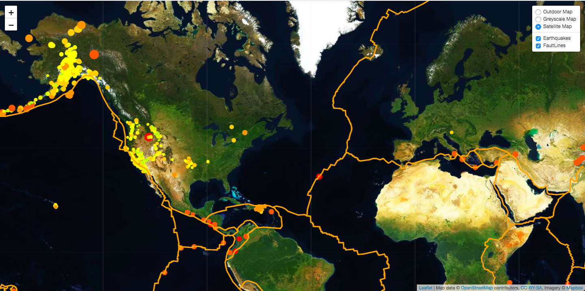

Geological Mapping using Leaflet: 

Using Leaflet, I've created a map reflecting data from the United States Geological Survey (USGS). The USGS is responsible for providing scientific data about natural hazards, the health of our ecosystems and environment; and the impacts of climate and land-use change. Their scientists develop new methods and tools to supply timely, relevant, and useful information about the Earth and its processes. 

I've built a new set of tools allowing us to visualize the earthquake data, along with faultlines, in hopes that this visualization will help better educate the public on issues facing our planet. 

